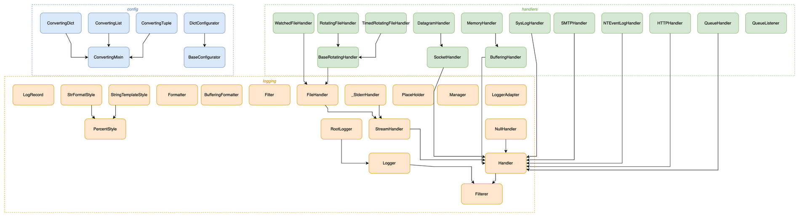
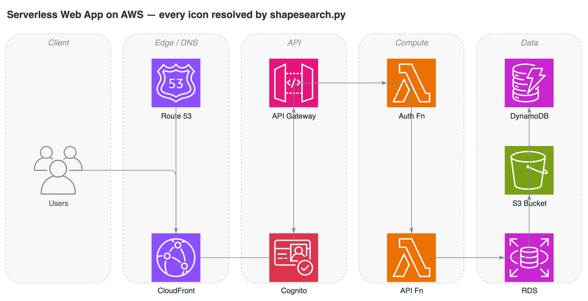
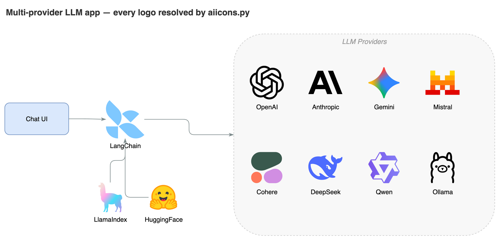
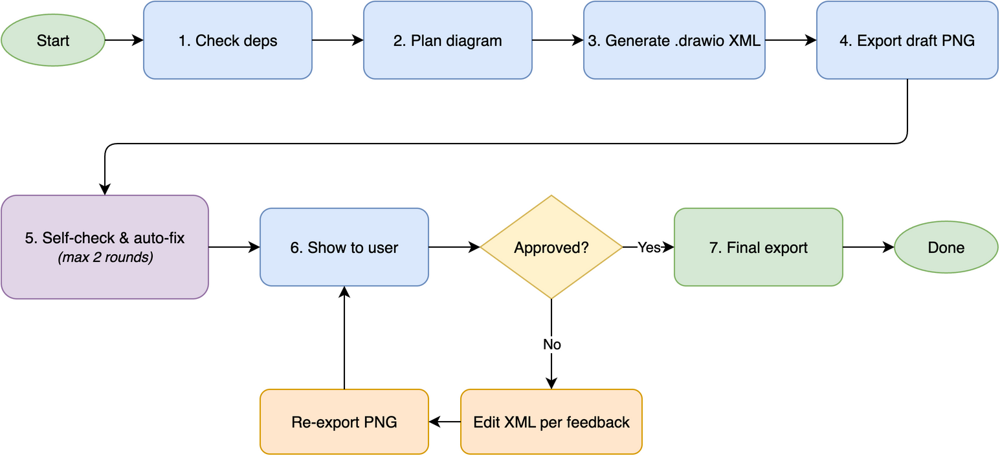

# drawio-skill — From Text to Professional Diagrams

[](LICENSE)
[](https://github.com/Agents365-ai/drawio-skill/stargazers)
[](https://github.com/Agents365-ai/drawio-skill/network/members)
[](https://github.com/Agents365-ai/drawio-skill/releases/latest)
[](https://github.com/Agents365-ai/drawio-skill/commits/main)

[](https://skillsmp.com/skills/agents365-ai-drawio-skill-skills-drawio-skill-skill-md)
[](https://clawhub.ai/agents365-ai/drawio-pro-skill)
[](https://github.com/Agents365-ai/365-skills)
[](https://agentskills.io)

**English** · [中文](README_CN.md) · [📖 Online Docs](https://agents365-ai.github.io/drawio-skill/)

A skill that turns natural-language descriptions into `.drawio` XML and exports them to PNG / SVG / PDF / JPG via the native draw.io desktop CLI. It can also turn an **existing codebase** (Python / JS-TS / Go / Rust), **Terraform / Kubernetes / docker-compose infrastructure**, or a **SQL schema** into an auto-laid-out diagram. Works with **Claude Code, Cursor, Copilot, OpenClaw, Codex, Autohand Code, Hermes**, and any agent compatible with the [Agent Skills](https://agentskills.io) format.

<p align="center">
  
</p>

## ✨ Highlights

- **7 diagram type presets** — ERD, UML Class, Sequence, C4, Architecture, ML/Deep Learning, Flowchart
- **Mermaid → native .drawio** (draw.io ≥ 30) — author 28 standard types as Mermaid text (**mindmap, gantt, timeline, journey, pie, sankey, kanban**…) and the CLI converts them into a laid-out, editable `.drawio` — structure in, layout free
- **Visualize a codebase** — extract and auto-lay-out the structure of a Python / JS-TS / Go / Rust project (import graphs) or a Python class hierarchy — Graphviz placement, transitive reduction, nested module containers
- **IaC → architecture diagram** — turn **Terraform** configs, **Kubernetes** manifests, or **docker-compose** files into an architecture diagram where every resource renders as its **official AWS / Azure / GCP / K8s icon**, edges derived from actual references (role ARNs, selectors, volume mounts)
- **SQL DDL → ER diagram** — parse `CREATE TABLE` statements into per-table nodes with PK/FK markers and crow's-foot foreign-key edges
- **Deterministic sequence diagrams** — describe participants + messages as JSON; lifelines, auto-tracked activation bars, and arrows are computed, never hand-placed
- **C4 model with drill-down** — one command generates the multi-page System Context → Container → Component set with official C4 shapes; parent elements **click through** to their child page
- **Search 10,000+ official shapes** — resolve the exact AWS / Azure / GCP / Cisco / Kubernetes / UML / BPMN icon style instead of guessing (no more blank-box `shape=mxgraph.*` typos)
- **AI / LLM brand logos** — 321 logos (OpenAI, Claude, Gemini, Mistral, Llama, Ollama, LangChain…) that draw.io has none of, plus **18 data-store brands** (Redis, Postgres, Qdrant, Milvus…) for LLM/RAG architecture diagrams
- **Self-check + auto-fix** — reads its own PNG output and auto-fixes overlaps, clipped labels, stacked edges, and more (up to 2 rounds)
- **Iterative feedback loop** — up to 5 rounds of targeted refinement
- **Style presets** — capture your visual style from a `.drawio` file or image, reuse on demand
- **Clean layout** — grid-aligned, spacing scales with diagram size, connectors routed clear of nodes
- **Multi-agent, zero-config** — runs from a single SKILL.md; no MCP server, no background daemon (the optional `npx` installer needs Node, the skill itself does not)

## 🖼️ Examples

> [!TIP]
> **The hero image above was generated from this single prompt:**

```
Create a microservices e-commerce architecture with Mobile/Web/Admin clients,
API Gateway (auth + rate limiting + routing), Auth/User/Order/Product/Payment
services, Kafka message queue, Notification service, and User DB / Order DB /
Product DB / Redis Cache / Stripe API
```

The skill is designed to route edges cleanly across different topologies, avoiding lines that cross through shapes:

<table>
  <tr>
    <td align="center" width="33%">
      <br>
      <b>Star</b> · 7 nodes<br>
      <sub>Central message broker with 6 microservices radiating outward, no edge crossings on this example.</sub>
    </td>
    <td align="center" width="33%">
      <br>
      <b>Layered</b> · 10 nodes / 4 tiers<br>
      <sub>E-commerce stack with horizontal and diagonal cross-connections routed via corridors.</sub>
    </td>
    <td align="center" width="33%">
      <br>
      <b>Ring</b> · 8 nodes<br>
      <sub>CI/CD pipeline with a closed loop and 2 spur branches flowing along the perimeter.</sub>
    </td>
  </tr>
</table>

Full walkthrough in [docs/USAGE.md](docs/USAGE.md).

## 🚀 Installation

### 1. Install the draw.io desktop CLI

| Platform | Command |
|----------|---------|
| **macOS** | `brew install --cask drawio` |
| **Windows** | [Download installer](https://github.com/jgraph/drawio-desktop/releases) |
| **Linux** | `.deb`/`.rpm` from [releases](https://github.com/jgraph/drawio-desktop/releases); `sudo apt install xvfb` for headless |

Verify with `drawio --version`. **Version ≥ 30 recommended** — it unlocks Mermaid → `.drawio` conversion and the ELK `--layout` pass (both unavailable on ≤ 29). On **WSL2** the CLI is the Windows desktop exe reached via `/mnt/c` — the skill detects this automatically (see [troubleshooting](skills/drawio-skill/references/troubleshooting.md)). Full recipes in [docs/INSTALL_CLI.md](docs/INSTALL_CLI.md).

### 2. Install the skill

```bash
# Any agent (Claude Code, Cursor, Copilot, ...)
npx skills add Agents365-ai/365-skills -g
```

```text
# Claude Code plugin marketplace
> /plugin marketplace add Agents365-ai/365-skills
> /plugin install drawio
```

```bash
# Manual install
git clone https://github.com/Agents365-ai/drawio-skill.git \
  ~/.claude/skills/drawio-skill

# Autohand Code global install
git clone https://github.com/Agents365-ai/drawio-skill.git \
  ~/.autohand/skills/drawio-skill

# Autohand Code project-level install
git clone https://github.com/Agents365-ai/drawio-skill.git \
  .autohand/skills/drawio-skill
```

Autohand Code also supports `autohand --skill-install` for cataloged skills, with `--project` for workspace-level installs. Until this skill is listed there, use the direct clone path above.

Also indexed on [SkillsMP](https://skillsmp.com/skills/agents365-ai-drawio-skill-skills-drawio-skill-skill-md) and [ClawHub](https://clawhub.ai/agents365-ai/drawio-pro-skill).

**Updating:** `/plugin update drawio` (Claude Code), `skills update drawio-skill` (SkillsMP), `clawhub update drawio-pro-skill` (OpenClaw), or `git pull` for manual installs — see [docs/INSTALL_SKILL.md#updates](docs/INSTALL_SKILL.md#updates). Release history in [CHANGELOG.md](CHANGELOG.md).

## ⚡ Quick Start

After installation, just describe what you want. For example, an ML model:

```
Draw a Transformer encoder-decoder for machine translation: 6-layer encoder
with self-attention, 6-layer decoder with cross-attention, input embeddings
(batch × 512 × 768), positional encoding, and a final output projection.
Annotate tensor shapes between layers and color-code by layer type.
```

The skill plans the layout, generates the `.drawio` XML, exports to your chosen format, self-checks the result, and lets you iterate.

## 🗺️ Visualize Code & Infrastructure

Beyond hand-authored diagrams, the skill turns **existing code, infrastructure, and schemas into diagrams** — no manual coordinates. Just ask:

> *"Visualize the module structure of this Python project"* · *"Draw the class hierarchy of `mypackage`"*

<p align="center">
  
</p>

<sub>↑ Python's <code>logging</code> package as a class hierarchy — one command, modules auto-boxed, every inheritance edge resolved.</sub>

Under the hood it runs a bundled extractor → auto-layout → validate pipeline:

```bash
# Import graph — Python / JS-TS / Go / Rust
python3 scripts/pyimports.py   myproject --group -o graph.json
python3 scripts/jsimports.py   ./src     --group -o graph.json
python3 scripts/goimports.py   ./module  --group -o graph.json
python3 scripts/rustimports.py ./crate   --group -o graph.json

# Python class-inheritance hierarchy
python3 scripts/pyclasses.py   mypackage --group -o graph.json

# Infrastructure as Code — official cloud icons resolved automatically
python3 scripts/tfimports.py   ./infra      -o graph.json   # Terraform → AWS/Azure/GCP icons
python3 scripts/k8simports.py  ./manifests  -o graph.json   # K8s YAML/JSON → kind icons
python3 scripts/composeimports.py compose.yml -o graph.json # services + named volumes

# Live infrastructure — draw what's ACTUALLY running / deployed
terraform show -json          | python3 scripts/tfstate.py -      -o graph.json  # deployed cloud
docker inspect $(docker ps -q)| python3 scripts/dockerimports.py -  -o graph.json  # running containers
kubectl get all,ing,cm,secret,pvc -o json | python3 scripts/k8simports.py - -o graph.json  # live cluster

# Data & interactions
python3 scripts/sqlerd.py      schema.sql   -o graph.json   # SQL DDL → ER diagram
python3 scripts/openapiimports.py openapi.yaml -o graph.json # OpenAPI/Swagger → API diagram (by method)
python3 scripts/seqlayout.py   seq.json  -o sequence.drawio # sequence diagram, direct to .drawio
python3 scripts/c4.py          c4.json   -o c4.drawio       # C4 model, multi-page + drill-down

# Diff two diagrams / snapshots → colour-coded "what changed"
python3 scripts/drawiodiff.py old.drawio new.drawio -o graph.json # +added -removed ~changed

# Architecture time-lapse → self-contained HTML player of how a codebase grew
python3 scripts/timelapse.py src --importer pyimports # → architecture-evolution.html

# Reverse: describe an existing .drawio as structured Markdown (README / PR summary)
python3 scripts/explain.py    architecture.drawio -o architecture.md

# Diagram → PowerPoint deck (one page per slide; C4 model → presentation)
python3 scripts/drawio2pptx.py c4.drawio -o c4.pptx   # needs: pip install python-pptx

# Interactive HTML viewer — pan/zoom/search/tabs + working drill-down links, one file
python3 scripts/drawiohtml.py c4.drawio -o c4.html

# Animated data-flow SVG — edges "flow" (marching ants); renders on GitHub
python3 scripts/svgflow.py    architecture.drawio -o flow.svg

# Reverse: .drawio → Mermaid flowchart (diagrams-as-code GitHub renders)
python3 scripts/drawio2mermaid.py architecture.drawio --fenced -o arch.md

# Colour an existing .drawio by data → cost / latency / traffic heat map
python3 scripts/heatmap.py    architecture.drawio -m latency.csv --size -o hot.drawio

# any extractor → auto-layout → editable .drawio
python3 scripts/autolayout.py  graph.json -o diagram.drawio
```

| Piece | What it does |
|---|---|
| **12 extractors** | import graphs for **Python · JS/TS · Go · Rust**, **Python class inheritance**, **Terraform / Kubernetes / docker-compose** resource graphs (official cloud icons), **SQL DDL → ERD**, **OpenAPI / Swagger → API diagram** (operations coloured by HTTP method + schemas), and **live** infra from `terraform show -json` / `docker inspect` / `kubectl get -o json` (draw what's actually deployed) |
| **Diagram diff** | `drawiodiff.py` compares two `.drawio` (or two live snapshots) into one colour-coded graph — added=green, removed=red, changed=orange — so you can see architecture / infra **drift** at a glance |
| **Metric heat map** | `heatmap.py` recolours an existing `.drawio` from a CSV/JSON of per-node values — cost / latency / traffic / error-rate shaded low→high on a gradient (optional size-by-value + legend), matched by cell id or label |
| **Architecture time-lapse** | `timelapse.py` re-runs an importer across a repo's git history and assembles a self-contained HTML player — watch modules & edges appear over time (▶ play / ‹ › step) |
| **Diagram → Markdown** | `explain.py` reverses a `.drawio` into a structured description — components by tier, relations, per-page for C4 — for dropping an architecture summary into a README or PR |
| **Interactive viewer** | `drawiohtml.py` publishes a `.drawio` as one self-contained HTML — page tabs, drag-pan, wheel-zoom, node search, and a C4 model's drill-down links keep working. Share the file; no draw.io, no server |
| **Diagram → PowerPoint** | `drawio2pptx.py` turns a multi-page diagram into a 16:9 deck (one page per slide, page name as title) — a C4 model becomes a ready-to-present slideshow |
| **Animated data-flow** | `svgflow.py` makes a diagram's edges *flow* (marching-ants animation along each arrow) — a self-contained looping SVG that renders on GitHub, in docs, or as a slide background |
| **Diagram → Mermaid** | `drawio2mermaid.py` converts a `.drawio` into a Mermaid `flowchart` (containers → subgraphs, edge labels kept) — paste it into Markdown as diagrams-as-code that GitHub renders natively |
| **Sequence engine** | `seqlayout.py` computes lifeline / activation-bar / arrow geometry from a message list — no Graphviz, no hand placement |
| **Auto-layout** | Graphviz places nodes and routes orthogonal edges *around* them — removes the manual-coordinate ceiling for large graphs. `--tune` tries both directions and keeps the more readable one |
| **Transitive reduction** | drops edges implied by a longer path, turning a dense hairball into a traceable graph (asyncio: 149 → 46 edges) |
| **Nested containers** | `--group` boxes modules by sub-package, nested for deep package trees |
| **Deterministic validator** | `validate.py` lints the `.drawio` (dangling edges, duplicate ids, overlaps) before the visual self-check |

Layout needs Graphviz (`brew install graphviz` / `apt install graphviz`) — optional; everything else works without it. Full format + flag reference in [references/autolayout.md](skills/drawio-skill/references/autolayout.md). Regenerate, validate (`--strict` gate) and render headlessly in CI: [docs/CI.md](docs/CI.md).

## 🧩 Supported Diagram Types

| Category | Examples | Notable features |
|---|---|---|
| Architecture | microservices, cloud (AWS/GCP/Azure), network topology, deployment | Tier-based swimlanes, hub-center strategy |
| C4 model | system context, containers, components | Multi-page `.drawio`, click-to-drill-down links |
| ML / Deep Learning | Transformer, CNN, LSTM, GRU | Tensor shape annotations, layer-type color coding |
| Flowcharts | business processes, workflows, decision trees, state machines | Semantic shapes (parallelogram I/O, diamond decisions) |
| UML | class diagrams, sequence diagrams | Inheritance / composition / aggregation arrows; lifelines + activation boxes |
| Data | ER diagrams, data flow diagrams (DFD) | Table containers, PK/FK notation |
| Mermaid-authored | mind maps, gantt, timeline, journey, pie, sankey, kanban + 20 more | Native CLI conversion (≥ v30) — structure only, layout free |
| Other | org charts, wireframes | — |

## 🔍 Shape Search

Need a real AWS / Azure / GCP / Cisco / Kubernetes / UML / BPMN icon? The skill searches **10,000+ official draw.io shapes** for the exact style string — so vendor icons render correctly instead of falling back to a blank box from a guessed `shape=mxgraph.*` name.

> *"Add an AWS Lambda wired to an S3 bucket"* · *"Use the real Kubernetes pod icon"*

```bash
python3 scripts/shapesearch.py "aws lambda" --limit 5
# → Lambda (77x93)
#   outlineConnect=0;...;shape=mxgraph.aws3.lambda;fillColor=#F58534;...
```

<p align="center">
  
</p>

<sub>↑ A serverless AWS architecture — every icon is the real official draw.io shape resolved by <code>shapesearch.py</code>, not a hand-guessed <code>shape=</code> string.</sub>

Covers AWS / Azure / GCP / Cisco / Kubernetes / UML / BPMN / ER / electrical / P&ID and the general shape sets. Hand-writable style cheatsheet + search usage in [references/shapes.md](skills/drawio-skill/references/shapes.md).

## 🤖 AI / LLM Brand Logos

draw.io ships **no** modern AI/LLM logos, so an LLM-app diagram renders as generic boxes. `aiicons.py` resolves a brand name to a draw.io image style for any of **321 logos** (OpenAI, Claude, Gemini, Mistral, Llama, Cohere, DeepSeek, Qwen, Ollama, LangChain, HuggingFace…) from [lobe-icons](https://github.com/lobehub/lobe-icons) (MIT), plus **18 data-store brands** (Redis, Postgres, MongoDB, Qdrant, Milvus, Supabase…) via [simple-icons](https://simpleicons.org) (CC0) for RAG stacks.

```bash
python3 scripts/aiicons.py "claude" --json      # CDN-referenced (default)
python3 scripts/aiicons.py "openai" --embed     # self-contained data URI
```

<p align="center">
  
</p>

<sub>↑ A multi-provider LLM app — every brand logo resolved by <code>aiicons.py</code>. Icons are referenced from the unpkg CDN by default (network needed at render time); <code>--embed</code> inlines them for offline use. Logos are trademarks of their owners, used for identification only.</sub>

## 🎨 Style Presets

Capture a visual style once, reuse it everywhere. Five presets are built in — `default`, `corporate`, `handdrawn`, `colorblind-safe` (Okabe-Ito palette), `dark` — and you can teach the skill your own style from a `.drawio` file or a flat image:

```
Draw a microservices architecture using my "corporate" style
```

```
Learn my style from ~/diagrams/brand.drawio as "mybrand"
```

The skill extracts colors, shapes, fonts, and edge style, renders a preview, and only saves the preset after you approve. Full preset-management commands in [docs/STYLE_PRESETS.md](docs/STYLE_PRESETS.md).

## 🔄 How it works

<p align="center">
  
</p>

Behind the scenes: **check dependencies → plan layout → generate `.drawio` XML → export draft PNG → self-check + auto-fix** (up to 2 rounds) → **show to user → 5-round feedback loop** until approved → **final export**.

## 🆚 Comparison

### vs Native Agent (no skill)

| Feature | Native agent | drawio-skill |
|---|---|---|
| Self-check after export | ❌ | ✅ reads PNG, auto-fixes 6 issue types |
| Iterative review loop | ❌ manual re-prompt | ✅ targeted edits, 5-round safety valve |
| Diagram type presets | ❌ | ✅ 7 presets (ERD, UML, Seq, C4, Arch, ML, Flow) |
| Mermaid → editable .drawio | ❌ | ✅ 28 types via native CLI conversion (≥ v30) |
| Visualize a codebase | ❌ | ✅ import graphs (Py/JS/Go/Rust) + class diagrams |
| IaC → architecture diagram | ❌ | ✅ Terraform / K8s / compose → official cloud icons |
| SQL DDL → ER diagram | ❌ | ✅ `CREATE TABLE` → PK/FK tables, crow's-foot edges |
| Sequence diagrams | ❌ hand-placed coordinates | ✅ deterministic geometry engine (`seqlayout.py`) |
| C4 model | ❌ | ✅ multi-page Context→Container→Component with click-to-drill-down |
| Auto-layout for large graphs | ❌ hand-places, overlaps | ✅ Graphviz placement, ortho routing, nested containers |
| Structural validation | ❌ | ✅ deterministic `.drawio` linter |
| Official shape search | ❌ guesses, blank boxes | ✅ exact style for 10k+ AWS/Azure/GCP/UML shapes |
| AI/LLM brand logos | ❌ none | ✅ 321 AI + 18 data-store logos via aiicons.py |
| Grid-aligned layout | ❌ | ✅ 10px snap, routing corridors |
| Color palette | random / inconsistent | ✅ 7-color semantic system |
| Style presets | ❌ | ✅ learn from `.drawio` file or image |

### vs Other draw.io Skills & Tools

| Feature | drawio-skill | [jgraph/drawio-mcp](https://github.com/jgraph/drawio-mcp) (official)<br> | [bahayonghang/drawio-skills](https://github.com/bahayonghang/drawio-skills)<br> | [GBSOSS/ai-drawio](https://github.com/GBSOSS/ai-drawio)<br> |
|---|---|---|---|---|
| **Approach** | Pure SKILL.md | MCP servers / Claude Code plugin / Project | YAML DSL + CLI (MCP optional) | Claude Code plugin |
| **Dependencies** | draw.io desktop only | draw.io desktop | draw.io desktop (MCP optional) | draw.io plugin + browser |
| **Multi-agent** | ✅ 6 platforms | ⚠️ MCP hosts (Claude, Cursor, VS Code) | ✅ Claude / Gemini / Codex | ❌ Claude Code only |
| **Self-check + auto-fix** | ✅ 2-round (reads PNG) | ❌ | ✅ validation + strict mode | ❌ screenshot only |
| **Iterative review** | ✅ 5-round loop | ❌ generate once | ✅ 3 workflows | ❌ |
| **Diagram presets** | ✅ 7 types | ❌ | ✅ paper-mode classifier | ❌ |
| **Mermaid authoring** | ✅ 28 types (CLI ≥ 30) | ✅ | ❌ | ❌ |
| **ML/DL diagrams** | ✅ tensor shapes, layer colors | ❌ | ❌ | ❌ |
| **Color system** | ✅ 7-color semantic | ❌ | ✅ 6 themes | ❌ |
| **Official shape search** | ✅ 10k+ shapes (local) | ✅ 10k+ shapes (MCP) | ❌ | ❌ |
| **AI/LLM brand logos** | ✅ 321 + 18 data-store | ❌ | ❌ | ❌ |
| **Browser fallback** | ✅ diagrams.net URL (viewer + editable) | ✅ diagrams.net URL (plugin) + inline preview | ✅ via optional MCP | ✅ diagrams.net viewer (primary) |
| **Zero-config** | ✅ copy `skills/drawio-skill/` | ✅ | ✅ desktop-only mode | ❌ needs plugin install |

> **Using the official jgraph plugin?** [jgraph/drawio-mcp](https://github.com/jgraph/drawio-mcp) now ships an official Claude Code plugin (`/plugin install drawio@drawio`) that also generates `.drawio` and exports via the desktop CLI. drawio-skill is complementary — reach for it when you want the code / IaC / SQL / OpenAPI importers, AI-brand logos, deterministic sequence & C4 generators, self-check + review loop, and the interactive HTML viewer, all from a single SKILL.md with no MCP server.

Full comparison + key-advantages summary in [docs/COMPARISON.md](docs/COMPARISON.md) (with audit timestamp).

## 🎯 When to use (and when not to)

**Good fit:**
- Polished, precise diagrams — stakeholder decks, architecture, network topology, strict UML, ER diagrams
- Solid opaque fills, 10,000+ official shapes, branded icons (AWS / Azure / GCP / Cisco / Kubernetes + AI/LLM logos), swimlanes, and custom geometry
- Anything you'll export to PNG / SVG / PDF and keep editable

**Reach for a sibling skill instead when you need:**
- **A casual, hand-drawn / whiteboard look** → [excalidraw-skill](https://github.com/Agents365-ai/excalidraw-skill) or [tldraw-skill](https://github.com/Agents365-ai/tldraw-skill)
- **Diagrams-as-code that live in git and render in Markdown** → [mermaid-skill](https://github.com/Agents365-ai/mermaid-skill) (general) or [plantuml-skill](https://github.com/Agents365-ai/plantuml-skill) (UML)
- **Freeform infinite-canvas sketching / freehand strokes** → [tldraw-skill](https://github.com/Agents365-ai/tldraw-skill)

## 🔗 Related Skills

Part of the [Agents365-ai diagram-skill family](https://github.com/Agents365-ai) — pick the right tool for the job:

| Skill | Style | Best for |
|---|---|---|
| [excalidraw-skill](https://github.com/Agents365-ai/excalidraw-skill) | Hand-drawn / sketchy | Whiteboard mockups, informal diagrams |
| [mermaid-skill](https://github.com/Agents365-ai/mermaid-skill) | Text-based, auto-layout | README-embeddable, version-control friendly |
| [plantuml-skill](https://github.com/Agents365-ai/plantuml-skill) | UML-focused | Class / sequence diagrams in CI pipelines |
| [tldraw-skill](https://github.com/Agents365-ai/tldraw-skill) | Whiteboard collaboration | Casual sketches, FigJam-style boards |

## ❤️ Support

If this skill helps you, consider supporting the author:

<table>
  <tr>
    <td align="center">
      
      <br>
      <b>WeChat Pay</b>
    </td>
    <td align="center">
      
      <br>
      <b>Alipay</b>
    </td>
    <td align="center">
      
      <br>
      <b>Buy Me a Coffee</b>
    </td>
    <td align="center">
      
      <br>
      <b>Give a Reward</b>
    </td>
  </tr>
</table>

## 👤 Author

**Agents365-ai**

- GitHub: https://github.com/Agents365-ai
- Bilibili: https://space.bilibili.com/441831884

## 📄 License

[MIT](LICENSE)
