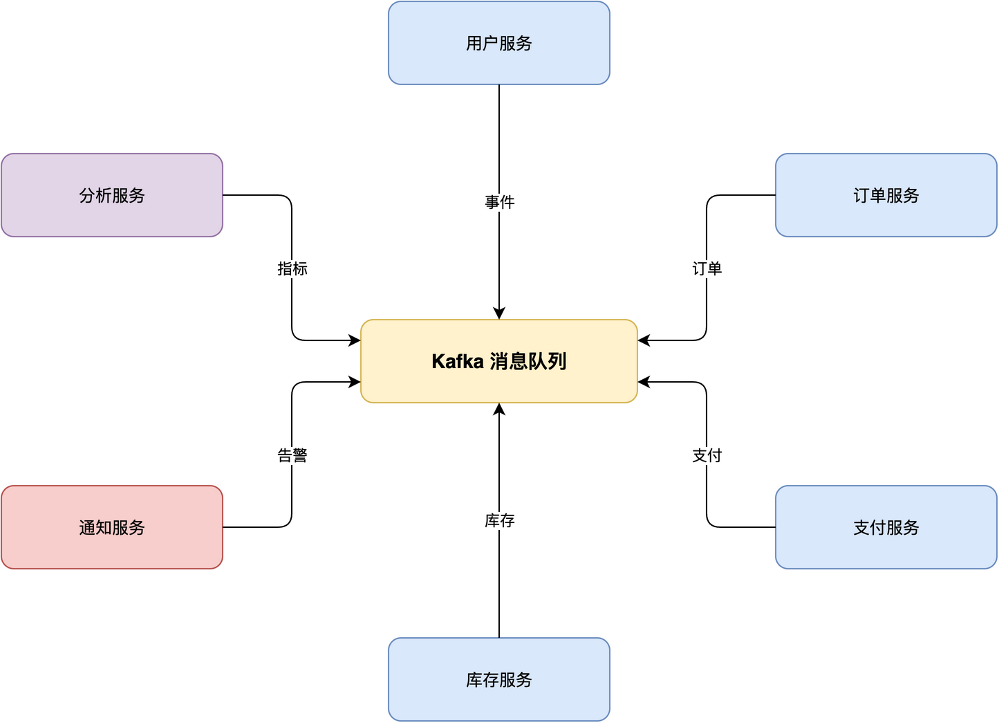
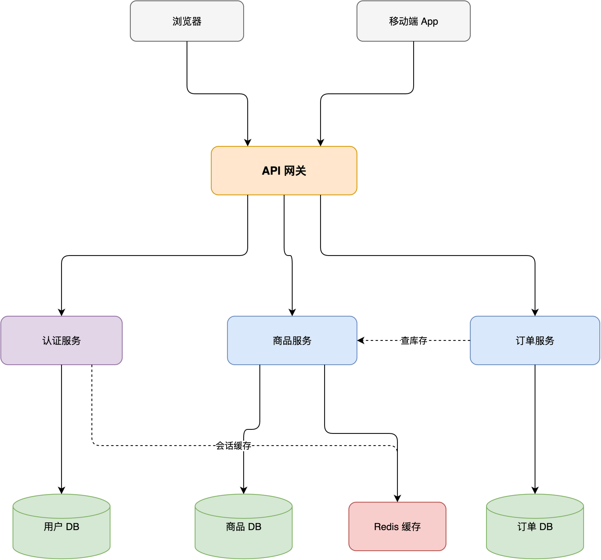
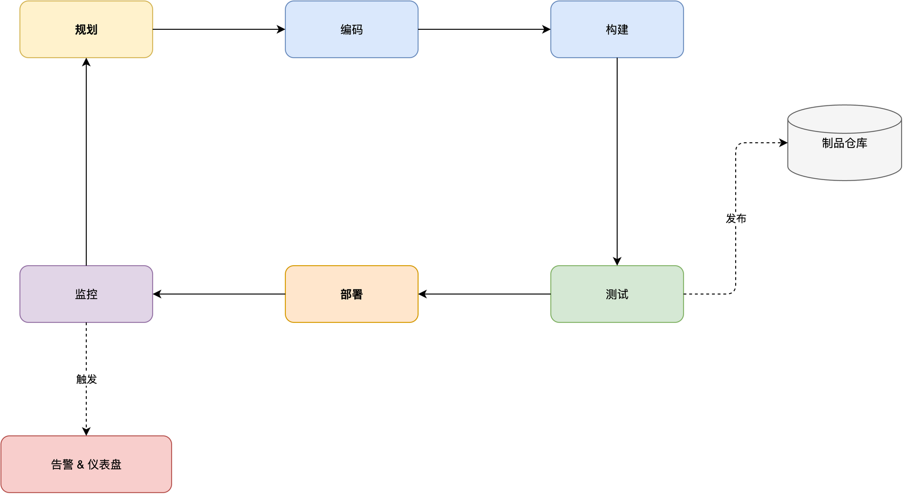
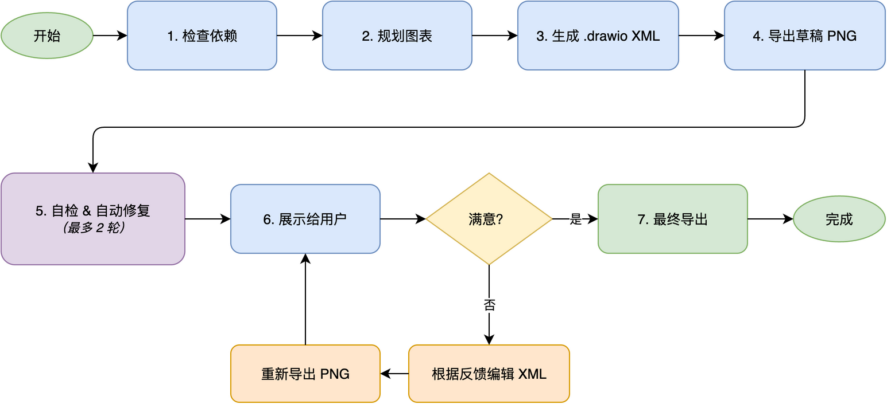

# drawio-skill —— 从文字到专业图表

[](LICENSE)
[](https://github.com/Agents365-ai/drawio-skill/stargazers)
[](https://github.com/Agents365-ai/drawio-skill/network/members)
[](https://github.com/Agents365-ai/drawio-skill/releases/latest)
[](https://github.com/Agents365-ai/drawio-skill/commits/main)

[](https://skillsmp.com/skills/agents365-ai-drawio-skill-skills-drawio-skill-skill-md)
[](https://clawhub.ai/agents365-ai/drawio-pro-skill)
[](https://github.com/Agents365-ai/365-skills)
[](https://agentskills.io)

[English](README.md) · **中文** · [📖 在线文档](https://agents365-ai.github.io/drawio-skill/)

一个把自然语言描述变成 `.drawio` XML，并通过 draw.io 桌面版原生 CLI 导出 PNG / SVG / PDF / JPG 的技能。它还能把**现有代码库**（Python / JS-TS / Go / Rust）、**Terraform / Kubernetes / docker-compose 基础设施**或 **SQL schema** 转成自动布局的图表。支持 **Claude Code、Cursor、Copilot、OpenClaw、Codex、Autohand Code、Hermes** 等任何兼容 [Agent Skills](https://agentskills.io) 规范的 agent。

<p align="center">
  
</p>

## ✨ 核心亮点

- **7 种图表类型预设** —— ER 图、UML 类图、序列图、C4、架构图、ML/深度学习、流程图
- **Mermaid → 原生 .drawio**（draw.io ≥ 30）—— 28 种标准类型直接用 Mermaid 文本作图（**mindmap、gantt、timeline、journey、pie、sankey、kanban**……），CLI 原生转成已布局、可编辑的 `.drawio` —— 只管结构，布局白送
- **可视化代码库** —— 提取并自动布局一个 Python / JS-TS / Go / Rust 项目的结构（导入关系图）或 Python 类继承层级 —— Graphviz 布点、传递约简、按子包嵌套的容器
- **IaC → 架构图** —— 把 **Terraform** 配置、**Kubernetes** manifest 或 **docker-compose** 文件直接变成架构图，每个资源渲染为**官方 AWS / Azure / GCP / K8s 图标**，连线来自真实引用（role ARN、selector、volume 挂载）
- **SQL DDL → ER 图** —— 解析 `CREATE TABLE` 语句，生成带 PK/FK 标记的表节点和鸦爪外键连线
- **确定性时序图** —— 用 JSON 描述参与者 + 消息序列，lifeline、自动追踪的激活条、箭头几何全部计算得出，无需手摆坐标
- **C4 模型 + 下钻** —— 一条命令生成多页 System Context → Container → Component 全套，官方 C4 形状配色，父元素**点击跳转**到子层页面
- **搜索 10,000+ 个官方形状** —— 直接拿到 AWS / Azure / GCP / Cisco / Kubernetes / UML / BPMN 图标的精确 style，不靠猜（杜绝 `shape=mxgraph.*` 拼错变空白框）
- **AI / LLM 品牌图标** —— 321 个 draw.io 自身没有的 logo（OpenAI、Claude、Gemini、Mistral、Llama、Ollama、LangChain……），外加 **18 个数据存储品牌**（Redis、Postgres、Qdrant、Milvus……），专为 LLM/RAG 应用架构图准备
- **自检 + 自动修复** —— 读取自己导出的 PNG，自动修复重叠、截断标签、连线堆叠等问题（最多 2 轮）
- **迭代反馈循环** —— 最多 5 轮定向优化
- **样式预设** —— 用 `.drawio` 文件或图片"教会"Skill 你的风格，命名保存后随时复用
- **整洁布局** —— 网格对齐，间距随图表规模缩放，连线避开节点
- **多智能体、零配置** —— 从单个 SKILL.md 运行，无需 MCP、无后台 daemon（可选的 `npx` 安装器需要 Node，skill 本身不需要）

## 🖼️ 示例

> [!TIP]
> **页首那张图就是用下面这条提示词生成的：**

```
画一个微服务电商架构图，包含 Mobile/Web/Admin 客户端，API Gateway（含认证+限流+路由），
Auth/User/Order/Product/Payment 微服务，Kafka 消息队列，Notification 服务，
以及 User DB / Order DB / Product DB / Redis Cache / Stripe API
```

Skill 在多种图表拓扑中尽量保持线条清晰路由，避免穿越无关形状：

<table>
  <tr>
    <td align="center" width="33%">
      <br>
      <b>星形</b> · 7 个节点<br>
      <sub>中央消息代理 + 6 个微服务辐射排列，本例中线条零交叉。</sub>
    </td>
    <td align="center" width="33%">
      <br>
      <b>分层</b> · 10 节点 / 4 层<br>
      <sub>电商架构，同层水平 + 对角线交叉连线均通过路由走廊绕行。</sub>
    </td>
    <td align="center" width="33%">
      <br>
      <b>环形</b> · 8 个节点<br>
      <sub>CI/CD 流水线，含闭合回路和 2 个分支，沿矩形外围流动。</sub>
    </td>
  </tr>
</table>

完整演练见 [docs/USAGE_CN.md](docs/USAGE_CN.md)。

## 🚀 安装

### 1. 安装 draw.io 桌面版 CLI

| 平台 | 命令 |
|------|------|
| **macOS** | `brew install --cask drawio` |
| **Windows** | [下载安装包](https://github.com/jgraph/drawio-desktop/releases) |
| **Linux** | 从 [releases](https://github.com/jgraph/drawio-desktop/releases) 下载 `.deb`/`.rpm`；无头导出需 `sudo apt install xvfb` |

用 `drawio --version` 验证。**推荐 ≥ 30 版本** —— 解锁 Mermaid → `.drawio` 转换和 ELK `--layout` 布局（≤ 29 两者均不可用）。在 **WSL2** 上，CLI 是通过 `/mnt/c` 访问的 Windows 桌面版 exe —— Skill 会自动识别（见[故障排查](skills/drawio-skill/references/troubleshooting.md)）。完整方案见 [docs/INSTALL_CLI_CN.md](docs/INSTALL_CLI_CN.md)。

### 2. 安装技能

```bash
# 任意 Agent（Claude Code、Cursor、Copilot 等）
npx skills add Agents365-ai/365-skills -g
```

```text
# Claude Code 插件市场
> /plugin marketplace add Agents365-ai/365-skills
> /plugin install drawio
```

```bash
# 手动安装
git clone https://github.com/Agents365-ai/drawio-skill.git \
  ~/.claude/skills/drawio-skill

# Autohand Code 全局安装
git clone https://github.com/Agents365-ai/drawio-skill.git \
  ~/.autohand/skills/drawio-skill

# Autohand Code 项目级安装
git clone https://github.com/Agents365-ai/drawio-skill.git \
  .autohand/skills/drawio-skill
```

Autohand Code 也支持通过 `autohand --skill-install` 安装已收录在 Autohand catalog 中的 skill，并可通过 `--project` 安装到当前项目。在该 skill 收录前，请使用上面的直接克隆方式。

同时索引于 [SkillsMP](https://skillsmp.com/skills/agents365-ai-drawio-skill-skills-drawio-skill-skill-md) 与 [ClawHub](https://clawhub.ai/agents365-ai/drawio-pro-skill)。

**更新：** `/plugin update drawio`（Claude Code）、`skills update drawio-skill`（SkillsMP）、`clawhub update drawio-pro-skill`（OpenClaw），或 `git pull`（手动安装）—— 详见 [docs/INSTALL_SKILL_CN.md#更新](docs/INSTALL_SKILL_CN.md#更新)。版本历史见 [CHANGELOG.md](CHANGELOG.md)。

## ⚡ 快速开始

装好之后直接描述你想要的图表，比如画一个 ML 模型：

```
画一个用于机器翻译的 Transformer 编码器-解码器：6 层编码器（自注意力），
6 层解码器（交叉注意力），输入嵌入（batch × 512 × 768），位置编码，
最后一层输出投影。在层之间标注张量形状，按层类型配色。
```

Skill 会自动规划布局、生成 `.drawio` XML、导出为你选择的格式、自检结果，并支持后续迭代。

## 🗺️ 可视化代码与基础设施

除了手写图表，Skill 还能把**现有代码、基础设施和 schema 变成图表** —— 无需手动摆坐标。直接说：

> *"可视化这个 Python 项目的模块结构"* · *"画出 `mypackage` 的类继承层级"*

<p align="center">
  
</p>

<sub>↑ Python <code>logging</code> 包的类继承层级 —— 一条命令生成，模块自动分框，每条继承边都被解析。</sub>

幕后是一条 提取器 → 自动布局 → 校验 的流水线：

```bash
# 导入关系图 —— Python / JS-TS / Go / Rust
python3 scripts/pyimports.py   myproject --group -o graph.json
python3 scripts/jsimports.py   ./src     --group -o graph.json
python3 scripts/goimports.py   ./module  --group -o graph.json
python3 scripts/rustimports.py ./crate   --group -o graph.json

# Python 类继承层级
python3 scripts/pyclasses.py   mypackage --group -o graph.json

# 基础设施即代码 —— 自动解析官方云图标
python3 scripts/tfimports.py   ./infra      -o graph.json   # Terraform → AWS/Azure/GCP 图标
python3 scripts/k8simports.py  ./manifests  -o graph.json   # K8s YAML/JSON → kind 图标
python3 scripts/composeimports.py compose.yml -o graph.json # 服务 + 命名卷

# 实时基础设施 —— 画「真正在运行 / 已部署」的东西
terraform show -json          | python3 scripts/tfstate.py -      -o graph.json  # 已部署的云资源
docker inspect $(docker ps -q)| python3 scripts/dockerimports.py -  -o graph.json  # 正在运行的容器
kubectl get all,ing,cm,secret,pvc -o json | python3 scripts/k8simports.py - -o graph.json  # 实时集群

# 数据与交互
python3 scripts/sqlerd.py      schema.sql   -o graph.json   # SQL DDL → ER 图
python3 scripts/openapiimports.py openapi.yaml -o graph.json # OpenAPI/Swagger → API 图（按方法着色）
python3 scripts/seqlayout.py   seq.json  -o sequence.drawio # 时序图，直接生成 .drawio
python3 scripts/c4.py          c4.json   -o c4.drawio       # C4 模型，多页 + 下钻

# 对比两张图 / 两个快照 → 高亮「改了什么」
python3 scripts/drawiodiff.py old.drawio new.drawio -o graph.json # +新增 -删除 ~变更

# 架构时间轴 → 从 git 历史生成「代码怎么长出来的」自包含 HTML 播放器
python3 scripts/timelapse.py src --importer pyimports # → architecture-evolution.html

# 反向：把已有的 .drawio 描述成结构化 Markdown（README / PR 摘要）
python3 scripts/explain.py    architecture.drawio -o architecture.md

# 图 → PowerPoint 幻灯片（每页一张；C4 模型 → 演示稿）
python3 scripts/drawio2pptx.py c4.drawio -o c4.pptx   # 需要: pip install python-pptx

# 交互式 HTML 查看器 —— 平移/缩放/搜索/页签 + 可用的下钻链接，单文件
python3 scripts/drawiohtml.py c4.drawio -o c4.html

# 数据流动画 SVG —— 让边「流动」起来（marching ants）；GitHub 可直接渲染
python3 scripts/svgflow.py    architecture.drawio -o flow.svg

# 反向：.drawio → Mermaid 流程图（GitHub 原生渲染的 diagrams-as-code）
python3 scripts/drawio2mermaid.py architecture.drawio --fenced -o arch.md

# 按数据给已有 .drawio 上色 → 成本 / 延迟 / 流量热力图
python3 scripts/heatmap.py    architecture.drawio -m latency.csv --size -o hot.drawio

# 任一提取器 → 自动布局 → 可编辑的 .drawio
python3 scripts/autolayout.py  graph.json -o diagram.drawio
```

| 组件 | 作用 |
|---|---|
| **12 个提取器** | **Python · JS/TS · Go · Rust** 的导入关系图、**Python 类继承**、**Terraform / Kubernetes / docker-compose** 资源图（自动配官方云图标）、**SQL DDL → ER 图**、**OpenAPI / Swagger → API 图**（按 HTTP 方法着色的接口 + schema），以及从 `terraform show -json` / `docker inspect` / `kubectl get -o json` 提取的**实时**基础设施（画出真正已部署的样子） |
| **图对比 (diff)** | `drawiodiff.py` 把两张 `.drawio`（或两个实时快照）对比成一张彩色图 —— 新增=绿、删除=红、变更=橙 —— 一眼看出架构 / 基础设施**漂移** |
| **指标热力图** | `heatmap.py` 按一份「节点→数值」的 CSV/JSON 给已有 `.drawio` 重新着色 —— 成本 / 延迟 / 流量 / 错误率沿渐变由低到高上色（可选按值缩放节点 + 自动图例），按 cell id 或标签匹配 |
| **架构时间轴** | `timelapse.py` 沿 git 历史逐个提交重跑提取器，拼成一个自包含 HTML 播放器 —— 看着模块和依赖边随时间长出来（▶ 播放 / ‹ › 单步） |
| **图 → Markdown** | `explain.py` 把一张 `.drawio` 反向描述成结构化文档 —— 按层级列出组件、关系、C4 多页分节 —— 方便把架构摘要塞进 README 或 PR |
| **交互式查看器** | `drawiohtml.py` 把 `.drawio` 发布成一个自包含 HTML —— 页签、拖拽平移、滚轮缩放、节点搜索，C4 模型的下钻链接照常可点。发一个文件即可分享；不需要 draw.io，也不需要服务器 |
| **图 → PowerPoint** | `drawio2pptx.py` 把多页图变成 16:9 幻灯片（每页一张、页名当标题）—— C4 模型一键变成可演示的 slideshow |
| **数据流动画** | `svgflow.py` 让图里的边「流动」起来（沿箭头方向的 marching-ants 动画）—— 自包含循环 SVG，可在 GitHub、文档或幻灯片背景里直接播放 |
| **图 → Mermaid** | `drawio2mermaid.py` 把 `.drawio` 转成 Mermaid `flowchart`（容器变 subgraph、保留边标签）—— 粘进 Markdown 就是 GitHub 原生渲染的 diagrams-as-code |
| **时序图引擎** | `seqlayout.py` 从消息列表直接算出 lifeline / 激活条 / 箭头几何 —— 不需要 Graphviz，不需要手摆 |
| **自动布局** | Graphviz 自动布点，正交连线**绕开**节点 —— 大图不再需要手动摆坐标。`--tune` 双向各排一次取更可读的 |
| **传递约简** | 删掉被更长路径蕴含的边，把密集的"毛线团"变成可读图（asyncio：149 → 46 条边） |
| **嵌套容器** | `--group` 按子包给模块分框，深层包树自动嵌套 |
| **确定性校验器** | `validate.py` 在视觉自检前先做结构 lint（悬空边、重复 id、重叠） |

布局需要 Graphviz（`brew install graphviz` / `apt install graphviz`）—— 可选，其余功能无需它。完整格式与参数见 [references/autolayout.md](skills/drawio-skill/references/autolayout.md)。在 CI 中重新生成、校验（`--strict` 门禁）并无头渲染：[docs/CI_CN.md](docs/CI_CN.md)。

## 🧩 支持的图表类型

| 类别 | 示例 | 特色 |
|------|------|------|
| 架构图 | 微服务、云（AWS/GCP/Azure）、网络拓扑、部署 | 分层泳道、hub 居中策略 |
| C4 模型 | 系统上下文、容器、组件 | 多页 `.drawio`、点击下钻链接 |
| ML / 深度学习 | Transformer、CNN、LSTM、GRU | 张量形状标注、层类型配色 |
| 流程图 | 业务流程、工作流、决策树、状态机 | 语义形状（平行四边形 I/O、菱形判断） |
| UML | 类图、序列图 | 继承 / 组合 / 聚合箭头；生命线 + 激活框 |
| 数据图 | ER 图、数据流图（DFD） | 表容器、PK/FK 标记 |
| Mermaid 作图 | 思维导图、甘特图、timeline、journey、饼图、桑基图、看板等 28 种 | CLI（≥ v30）原生转换 —— 只写结构，布局白送 |
| 其他 | 组织架构图、线框图 | — |

## 🔍 形状搜索

需要真实的 AWS / Azure / GCP / Cisco / Kubernetes / UML / BPMN 图标？Skill 会在 **10,000+ 个官方 draw.io 形状**中搜出精确的 style 字符串 —— 厂商图标正确渲染，而不是因为猜错 `shape=mxgraph.*` 名称而退化成空白方框。

> *"加一个 AWS Lambda 连到 S3 桶"* · *"用真正的 Kubernetes pod 图标"*

```bash
python3 scripts/shapesearch.py "aws lambda" --limit 5
# → Lambda (77x93)
#   outlineConnect=0;...;shape=mxgraph.aws3.lambda;fillColor=#F58534;...
```

<p align="center">
  
</p>

<sub>↑ 一张 AWS 无服务器架构图 —— 每个图标都是 <code>shapesearch.py</code> 解析出的真实官方 draw.io 形状，而非手猜的 <code>shape=</code> 字符串。</sub>

覆盖 AWS / Azure / GCP / Cisco / Kubernetes / UML / BPMN / ER / 电气 / P&ID 以及通用形状集。可手写的 style 速查表 + 搜索用法见 [references/shapes.md](skills/drawio-skill/references/shapes.md)。

## 🤖 AI / LLM 品牌图标

draw.io **没有**任何现代 AI/LLM 品牌图标，所以画 LLM 应用架构时只能是一堆方框。`aiicons.py` 能把品牌名解析成 draw.io 图片样式，覆盖 [lobe-icons](https://github.com/lobehub/lobe-icons)（MIT）的 **321 个图标**（OpenAI、Claude、Gemini、Mistral、Llama、Cohere、DeepSeek、Qwen、Ollama、LangChain、HuggingFace……），并经 [simple-icons](https://simpleicons.org)（CC0）补充 **18 个数据存储品牌**（Redis、Postgres、MongoDB、Qdrant、Milvus、Supabase……），适合 RAG 架构图。

```bash
python3 scripts/aiicons.py "claude" --json      # CDN 引用（默认）
python3 scripts/aiicons.py "openai" --embed     # 内联为自包含 data URI
```

<p align="center">
  
</p>

<sub>↑ 一张多供应商 LLM 应用图 —— 每个品牌 logo 都由 <code>aiicons.py</code> 解析。默认从 unpkg CDN 引用图标（渲染时需联网），<code>--embed</code> 可内联以离线使用。logo 为各自所有者的商标，仅用于标识。</sub>

## 🎨 样式预设

把视觉风格"教"给 Skill 一次，所有图表自动复用。内置五种预设：`default`、`corporate`、`handdrawn`、`colorblind-safe`（Okabe-Ito 色盲安全色板）、`dark`；也可以从 `.drawio` 文件或图片学习你的风格：

```
画一个微服务架构图，使用我的 "corporate" 样式
```

```
从 ~/diagrams/brand.drawio 学习我的样式，保存为 "mybrand"
```

Skill 会提取配色、形状、字体和连线风格，渲染预览图，**确认后**才保存预设。完整管理命令见 [docs/STYLE_PRESETS_CN.md](docs/STYLE_PRESETS_CN.md)。

## 🔄 工作流程

<p align="center">
  
</p>

幕后流程：**检查依赖 → 规划布局 → 生成 `.drawio` XML → 导出草稿 PNG → 自检 + 自动修复**（最多 2 轮）→ **展示给用户 → 5 轮反馈循环**直到满意 → **最终导出**。

## 🆚 对比

### 对比原生智能体（无 skill）

| 功能 | 原生智能体 | drawio-skill |
|------|-----------|--------------|
| 导出后自检 | ❌ | ✅ 读取 PNG 自动修复 6 类问题 |
| 迭代审查循环 | ❌ 需手动重新提问 | ✅ 定向编辑，5 轮安全阀 |
| 图表类型预设 | ❌ | ✅ 7 种（ERD、UML、序列、C4、架构、ML、流程） |
| Mermaid → 可编辑 .drawio | ❌ | ✅ 28 种类型，CLI 原生转换（≥ v30） |
| 可视化代码库 | ❌ | ✅ 导入关系图（Py/JS/Go/Rust）+ 类图 |
| IaC → 架构图 | ❌ | ✅ Terraform / K8s / compose → 官方云图标 |
| SQL DDL → ER 图 | ❌ | ✅ `CREATE TABLE` → PK/FK 表节点 + 鸦爪连线 |
| 时序图 | ❌ 手摆坐标易出错 | ✅ 确定性几何引擎（`seqlayout.py`） |
| C4 模型 | ❌ | ✅ 多页 Context→Container→Component + 点击下钻 |
| 大图自动布局 | ❌ 手动摆放、易重叠 | ✅ Graphviz 布点、正交路由、嵌套容器 |
| 结构校验 | ❌ | ✅ 确定性 `.drawio` linter |
| 官方形状搜索 | ❌ 靠猜、变空白框 | ✅ 1 万+ AWS/Azure/GCP/UML 形状的精确 style |
| AI/LLM 品牌图标 | ❌ 没有 | ✅ 321 个 AI logo + 18 个数据存储品牌，经 aiicons.py |
| 网格对齐布局 | ❌ | ✅ 10px 对齐、路由走廊 |
| 配色方案 | 随机 / 不一致 | ✅ 7 色语义系统 |
| 样式预设 | ❌ | ✅ 从 `.drawio` 文件或图片学习 |

### 对比其他 draw.io Skills 与工具

| 功能 | drawio-skill | [jgraph/drawio-mcp](https://github.com/jgraph/drawio-mcp)（官方）<br> | [bahayonghang/drawio-skills](https://github.com/bahayonghang/drawio-skills)<br> | [GBSOSS/ai-drawio](https://github.com/GBSOSS/ai-drawio)<br> |
|------|------|------|------|------|
| **方式** | 纯 SKILL.md | MCP 服务 / Claude Code 插件 / Project | YAML DSL + CLI（MCP 可选） | Claude Code 插件 |
| **依赖** | 仅 draw.io 桌面版 | draw.io 桌面版 | draw.io 桌面版（MCP 可选） | draw.io 插件 + 浏览器 |
| **多智能体支持** | ✅ 6 个平台 | ⚠️ MCP 宿主（Claude、Cursor、VS Code） | ✅ Claude / Gemini / Codex | ❌ 仅 Claude Code |
| **自检 + 自动修复** | ✅ 2 轮（读取 PNG） | ❌ | ✅ 校验 + 严格模式 | ❌ 仅截图 |
| **迭代审查** | ✅ 5 轮循环 | ❌ 一次生成 | ✅ 3 种工作流 | ❌ |
| **图表预设** | ✅ 7 种 | ❌ | ✅ 论文模式分类 | ❌ |
| **Mermaid 作图** | ✅ 28 种（CLI ≥ 30） | ✅ | ❌ | ❌ |
| **ML/DL 图** | ✅ 张量标注、层配色 | ❌ | ❌ | ❌ |
| **配色系统** | ✅ 7 色语义 | ❌ | ✅ 6 种主题 | ❌ |
| **官方形状搜索** | ✅ 1 万+ 形状（本地） | ✅ 1 万+ 形状（MCP） | ❌ | ❌ |
| **AI/LLM 品牌图标** | ✅ 321 + 18 数据存储 | ❌ | ❌ | ❌ |
| **浏览器降级** | ✅ diagrams.net URL（查看 + 可编辑） | ✅ diagrams.net URL（插件）+ 内联预览 | ✅ 通过可选 MCP | ✅ diagrams.net viewer（主要） |
| **零配置** | ✅ 复制 `skills/drawio-skill/` | ✅ | ✅ 桌面版模式 | ❌ 需安装插件 |

> **在用官方 jgraph 插件？** [jgraph/drawio-mcp](https://github.com/jgraph/drawio-mcp) 现已提供官方 Claude Code 插件（`/plugin install drawio@drawio`），同样生成 `.drawio` 并通过桌面版 CLI 导出。drawio-skill 与之互补 —— 当你需要代码 / IaC / SQL / OpenAPI 导入器、AI 品牌图标、确定性时序图与 C4 生成器、自检 + 审查循环以及交互式 HTML 查看器，且只想用单个 SKILL.md、无需 MCP 服务时，选它。

完整对比 + 核心优势总结见 [docs/COMPARISON_CN.md](docs/COMPARISON_CN.md)（含核查时间戳）。

## 🎯 何时用(以及何时别用)

**适合:**
- 精致、精确的图 —— 汇报/决策用图、架构图、网络拓扑、严格 UML、ER 图
- 不透明实色填充、10,000+ 官方图形、品牌图标(AWS / Azure / GCP / Cisco / Kubernetes + AI/LLM logo)、泳道、自定义几何
- 需要导出 PNG / SVG / PDF 且保持可编辑的场景

**这些情况请改用同系列的其它 skill:**
- **随性的手绘 / 白板观感** → [excalidraw-skill](https://github.com/Agents365-ai/excalidraw-skill) 或 [tldraw-skill](https://github.com/Agents365-ai/tldraw-skill)
- **以代码形式存进 git、在 Markdown 里渲染的图** → [mermaid-skill](https://github.com/Agents365-ai/mermaid-skill)(通用)或 [plantuml-skill](https://github.com/Agents365-ai/plantuml-skill)(UML)
- **无限画布自由涂鸦 / 自由笔迹** → [tldraw-skill](https://github.com/Agents365-ai/tldraw-skill)

## 🔗 相关 Skill

[Agents365-ai 图表 skill 家族](https://github.com/Agents365-ai) 一员 —— 按场景挑工具：

| Skill | 风格 | 适用场景 |
|---|---|---|
| [excalidraw-skill](https://github.com/Agents365-ai/excalidraw-skill) | 手绘 / 草图 | 白板原型、非正式图 |
| [mermaid-skill](https://github.com/Agents365-ai/mermaid-skill) | 文本驱动、自动布局 | 可嵌入 README、易于版本管理 |
| [plantuml-skill](https://github.com/Agents365-ai/plantuml-skill) | UML 专精 | CI 流水线里的类图 / 序列图 |
| [tldraw-skill](https://github.com/Agents365-ai/tldraw-skill) | 白板协作 | 随手画、FigJam 风格 |

## ❤️ 支持作者

如果这个 skill 对你有帮助，欢迎支持作者：

<table>
  <tr>
    <td align="center">
      
      <br>
      <b>微信支付</b>
    </td>
    <td align="center">
      
      <br>
      <b>支付宝</b>
    </td>
    <td align="center">
      
      <br>
      <b>Buy Me a Coffee</b>
    </td>
    <td align="center">
      
      <br>
      <b>打赏</b>
    </td>
  </tr>
</table>

## 👤 作者

**Agents365-ai**

- GitHub: https://github.com/Agents365-ai
- Bilibili: https://space.bilibili.com/441831884

## 📄 许可证

[MIT](LICENSE)
