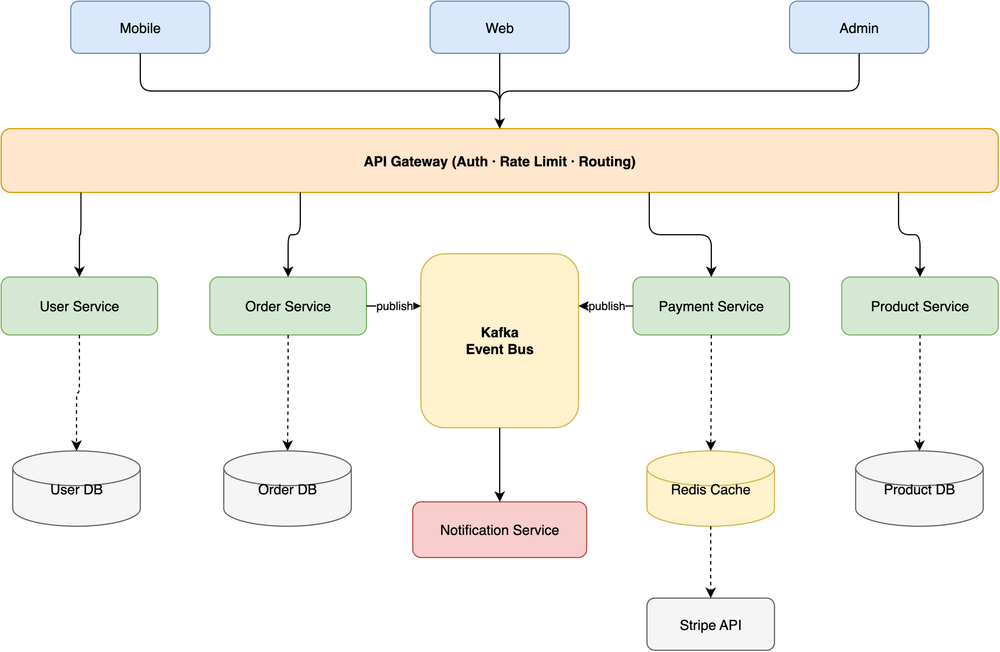
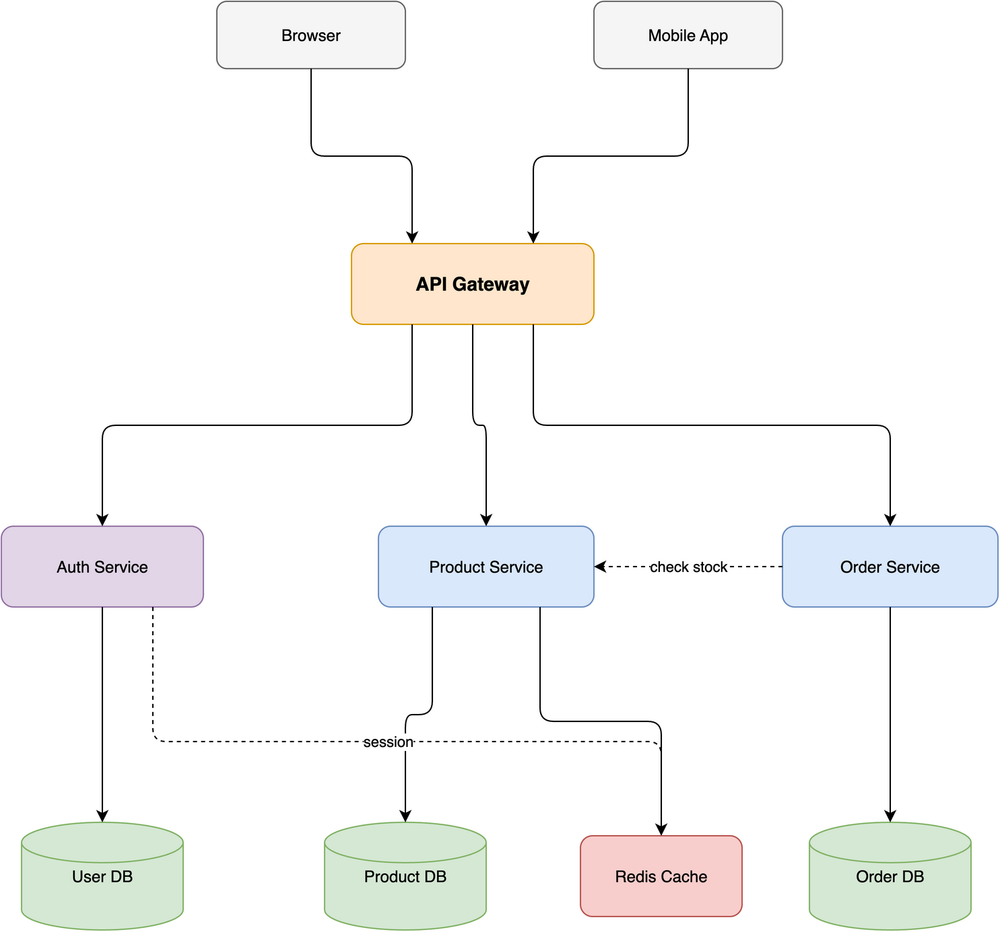

# Usage

[中文](USAGE_CN.md)

Just describe what you want:

```
Create a microservices e-commerce architecture with API Gateway, auth/user/order/product/payment services,
Kafka message queue, notification service, and separate databases for each service
```

The agent will generate the `.drawio` XML file and export it to PNG automatically.

## Example

**Prompt:**
> Create a microservices e-commerce architecture with Mobile/Web/Admin clients, API Gateway,
> Auth/User/Order/Product/Payment services, Kafka message queue, Notification service,
> and User DB / Order DB / Product DB / Redis Cache / Stripe API

**Output:**



## Topology demos

The skill handles various diagram topologies with clean edge routing — no lines crossing through shapes.

### Star topology (7 nodes)

Central message broker with 6 microservices radiating outward. Edges enter Kafka from different sides, zero crossings.


### Layered flow (10 nodes, 4 tiers)

E-commerce architecture with 2 cross-connections: Order→Product (same-tier horizontal) and Auth→Redis (diagonal via routing corridor). All edges route cleanly.



### Ring / cycle (8 nodes)

CI/CD pipeline with a closed loop and 2 spur branches. Edges flow along the perimeter without crossing the interior.


## Visualize a codebase

Turn an existing project into an auto-laid-out structure diagram — no manual coordinates. Just ask: *"Visualize the module structure of this Python project"* or *"Draw the class hierarchy of `mypackage`"*. Under the hood it runs a bundled extractor → auto-layout → validate pipeline:

```bash
# Import graph — Python / JS-TS / Go / Rust
python3 scripts/pyimports.py   myproject --group -o graph.json
python3 scripts/jsimports.py   ./src     --group -o graph.json
python3 scripts/goimports.py   ./module  --group -o graph.json
python3 scripts/rustimports.py ./crate   --group -o graph.json

# Python class-inheritance hierarchy
python3 scripts/pyclasses.py   mypackage --group -o graph.json

# any extractor → auto-layout → editable .drawio
python3 scripts/autolayout.py  graph.json -o diagram.drawio
```

Graphviz places nodes and routes orthogonal edges around them, transitive reduction thins dense graphs, `--group` boxes modules by sub-package, and `validate.py` lints the `.drawio` (dangling edges, duplicate ids, overlaps) before the visual self-check. Layout needs Graphviz (`brew install graphviz` / `apt install graphviz`) — optional; everything else works without it.

## Shape search

Need a real AWS / Azure / GCP / Cisco / Kubernetes / UML / BPMN icon? The skill searches 10,000+ official draw.io shapes for the exact style string — so vendor icons render correctly instead of falling back to a blank box from a guessed `shape=mxgraph.*` name:

```bash
python3 scripts/shapesearch.py "aws lambda" --limit 5
# → Lambda (77x93)
#   outlineConnect=0;...;shape=mxgraph.aws3.lambda;fillColor=#F58534;...
```

## AI / LLM brand logos

draw.io ships no modern AI/LLM logos, so an LLM-app diagram renders as generic boxes. `aiicons.py` resolves a brand name to a draw.io image style for any of 321 logos (OpenAI, Claude, Gemini, Mistral, Llama, Ollama, LangChain…) from [lobe-icons](https://github.com/lobehub/lobe-icons) (MIT):

```bash
python3 scripts/aiicons.py "claude" --json      # CDN-referenced (default)
python3 scripts/aiicons.py "openai" --embed     # self-contained data URI
```

## Rendering in CI

Regenerate, lint (`validate.py --strict`), and export diagrams headlessly in GitHub Actions — via draw.io desktop under `xvfb` or the Docker REST renderer. Full workflow recipes in [CI.md](CI.md).
